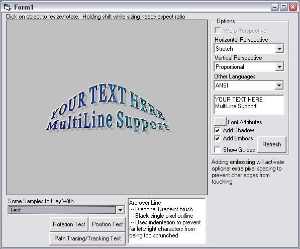



## LaVolpe WordArt \(GDI\+ Paths\) \[27 Mar 08\]

### Description

Updated:: Fixed mem leak save routine (oops); added minimal unicode support to sample form for playing &amp; as promised, SaveAs Jpg/Png/Bmp capable. A project I wrote to learn more about GDI+ graphics paths. Think it can be useful for others who want to explore paths. I thought I was going to make this a full-blown WordArt-clone but have since lost interest. This project may be updated in the future, but it will remain low on my priorities. Graphic paths are fun to play with, but short of creating a Paint-like application or using paths to manipulated direction/speed of some animated object I can't find much use for them. Have fun playing with it.

26Mar08: Added ability to save a GDI+ path to JPG, Bitmap and/or PNG formats. 27Mar08: Found &amp; fixed mem leak in save routine. In sample form, added some unicode support for playing.
 
### More Info
 

             |
---                |---
**Submitted On**   |2008-03-26 22:26:36
**By**             |[LaVolpe](https://github.com/Planet-Source-Code/PSCIndex/blob/master/ByAuthor/lavolpe.md)
**Level**          |Intermediate
**User Rating**    |5.0 (155 globes from 31 users)
**Compatibility**  |VB 6\.0
**Category**       |[Graphics](https://github.com/Planet-Source-Code/PSCIndex/blob/master/ByCategory/graphics__1-46.md)
**World**          |[Visual Basic](https://github.com/Planet-Source-Code/PSCIndex/blob/master/ByWorld/visual-basic.md)
**Archive File**   |[LaVolpe\_Wo2107533262008\.zip](https://github.com/Planet-Source-Code/lavolpe-lavolpe-wordart-gdi-paths-27-mar-08__1-70216/archive/master.zip)

